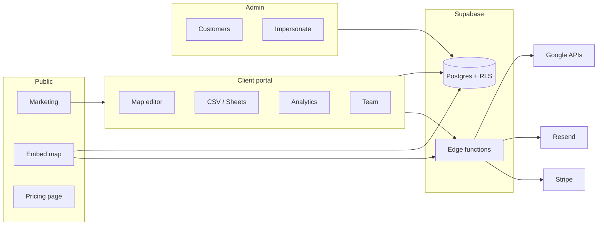

# Directory Maps — feature inventory

This document describes **all major features** in the application: what they do, who can use them, and where they live in the codebase. Use it for onboarding, beta planning, and support.

**Related:** [USER_GUIDE.md](./USER_GUIDE.md) (client how-to) · [BETA_READINESS.md](./BETA_READINESS.md) (launch gaps) · specialist docs linked per section.

---

## 1. Architecture overview

**Tenancy model**

- **Organisation** = row in `clients` (name, slug, subscription flags, optional Resend domain).
- **User** = Supabase Auth account, linked via `contacts` (`client_id`, `role`, permissions).
- **Platform admin** = `profiles.role = 'admin'` (cross-tenant access, impersonation).
- **Map** = belongs to one client; **listings** and **groups** belong to a map.

---

## 2. Public & marketing

| Feature | Route | Description | Key files |
|---------|-------|-------------|-----------|
| Landing page | `/#/` | Product overview, links to signup and admin | `src/pages/PublicMap.jsx` |
| Marketing pricing | `/#/pricing` | Static plan cards (Starter / Pro / Agency, GBP monthly) | `src/pages/Pricing.jsx` |
| Terms & conditions | `/#/terms` | Renders legal markdown | `src/pages/Terms.jsx`, `docs/MARKDOWN/...` |
| Privacy notice | `/#/privacy` | Renders legal markdown | `src/pages/Privacy.jsx`, `docs/MARKDOWN/...` |
| Site chrome | — | Header nav, footer, brand | `src/components/SiteHeader.jsx`, `SiteFooter.jsx` |
| Global error boundary | — | Catches uncaught React errors | `src/components/ErrorBoundary.jsx` |

**Note:** Marketing pricing (`Pricing.jsx`) is **not** the same as checkout plans in the publish flow (`PricingPlans.jsx` — Standard / Premium / Unlimited, yearly GBP). Align copy and plan IDs before public launch.

---

## 3. Authentication & account lifecycle

| Feature | Route | Description | Key files |
|---------|-------|-------------|-----------|
| Sign in | `/#/login` | Email/password; redirect after login; banners for verification / unlinked account | `src/pages/Login.jsx`, `AuthForm.jsx` |
| Sign up | `/#/signup` | Organisation name, auto slug, email/password; provisions `clients` + `contacts` | `src/pages/SignUp.jsx`, `provisionClientSignup.js` |
| Team invite signup | `/#/signup?invite=<uuid>` | Join existing org (no new org); email prefilled; password + verification | `inviteHelpers.js`, RPC `get_team_invitation_preview` |
| Team invite login | `/#/login?invite=<uuid>` | Existing users accept invite with password | `Login.jsx`, `acceptPendingInvitation` |
| Slug availability | — | RPC `is_client_slug_available` (timeout-tolerant) | `src/lib/authHelpers.js` |
| Forgot / reset password | `/#/forgot-password`, `/#/reset-password` | Supabase password recovery | respective pages |
| Email verification gate | `/client/*` | Portal blocked until `email_confirmed_at` | `src/components/ClientGate.jsx` |
| Session & admin role | — | Auth context, token refresh, signup provisioning mutex | `src/context/AuthContext.jsx`, `src/lib/auth.js` |
| Auth error redirect | — | HashRouter workaround for Supabase auth errors | `src/Root.jsx` |

**Post-signup provisioning:** `provisionClientSignup` creates the organisation and primary contact from `user_metadata` (organisation name, slug). Skipped for team-invite signups (no `signup_org_*` metadata). **Team accept:** `acceptPendingInvitation` runs on every login before provisioning.

**Auth model:** Email + password everywhere. Email verification and password-reset use one-time links; there is no passwordless magic-link login.

---

## 4. Client portal

**Base route:** `/#/client` · **Gate:** signed-in user with verified email and linked `contacts` row.

### 4.1 Navigation & layout

| Feature | Route | Description |
|---------|-------|-------------|
| My Maps | `/#/client` | Dashboard grid of maps, data-source badges, links to stats |
| Team | `/#/client/team` | Manage organisation contacts (requires `can_manage_users` or primary) |
| Messaging | `/#/client/email` | Settings tab: enable/disable messaging, custom sending domain via Resend, contact-form prompt, email subject/opening line. **Sent messages** tab: paginated log of `map_contact_submissions` for the org (requires map-management permission) |
| Map sub-nav | `/#/client/maps/:id/*` | Design · Data · Stats |

Layout: `src/pages/client/ClientLayout.jsx` · Context: `ClientContext`, `getClientAndContact.js`.

### 4.2 Maps — create & list

| Feature | Description |
|---------|-------------|
| New map | Name, slug, default center/zoom, list panel, clustering |
| Map list | All maps for the organisation; open design, data, or stats |

Files: `ClientDashboard.jsx`, `ClientMapNew.jsx`, `MapsView.jsx`.

### 4.3 Map design & publish

The map editor (`ClientMapDashboard.jsx`) is a **live preview** with overlay panels:

| Panel | Purpose |
|-------|---------|
| **General** | Name, slug, **description** (long text, shown in the search panel), default lat/lng/zoom, list panel, clustering (auto-saved draft) |
| **Pin Design** | Marker style (pin/rounded pin/dot), size, colour, border, favicon overlay, drop shadow; previews rendered at true map proportions |
| **Panels** | Listing panel layout and content options |
| **Groups** | Group definitions and per-group theme JSON |
| **Map Style** | Presets + base type, colours, detail sliders, and overlay toggles |
| **Filters** | Define custom filter fields (single-select / multi-select / text), manage options + colours, and configure display (`show_in_filter_bar`, `display_control`, order). Definitions/options save immediately; display config is part of the draft→publish snapshot. Shared `FilterFieldsPanel.jsx` |
| **Publish Map** | Publish snapshot, version history, rollback, embed URL, subscription gate |
| **Search** | Search-panel logo upload + styling (panel background colour/transparency, listing background, border, transparency) + **Display options** (continent filter on/off, Key on/off); stored in `theme_json`, auto-saved draft. Includes a read-only summary of custom filter fields with a link to the **Filters** panel |

**Custom filter fields**

- Defined per map in the **Filters** panel (`FilterFieldsPanel.jsx`, shared by client + admin dashboards). Three field types: `single_select`, `multi_select`, `text`. Select types have colour-coded options.
- Values are tagged per listing (EAV rows in `listing_filter_values`) via the manual listing editor (`ListingFilterValuesEditor.jsx`), bulk edit (`BulkFilterEditModal.jsx`), CSV, or Google Sheets (`filter_<key>` columns).
- **Options auto-create on ingest:** CSV import (`ensureImportOptions` in `filterFields.js`) and Sheets sync (`sync_sheet_listings`) add any option value not already defined, so clients don't have to pre-enter categories. The viewer hides options with zero tagged listings (and select fields with no populated options).
- Display config (which fields show in the search bar, control type, order) flows through `buildPublicationConfig` and the CDN snapshot; matching is OR within a field, AND across fields (mirrors groups/continents).
- Data access + helpers: `src/lib/filterFields.js`. Admin events: `map_design_filter_field_*`, `data_filter_values_bulk_tagged`.

**Publication system**

- **Publish** calls RPC `publish_map` → stores versioned config in `map_publications`, sets `maps.published_at` and `published_config`.
- **Rollback** via `rollback_map_to` and publication list (`list_map_publications`).
- **Draft state** warns on navigation when unsaved; publish panel open state persists per map in `sessionStorage`.

Files: `mapPublication.js`, `MapDraftContext.js`, `publishPanelStorage.js`.

**Subscription gate (publish / embed):** `hasSubscriptionAccess` in `subscriptionAccess.js` — true if `clients.subscription_active_override`, or user email domain contains `layercake`. Stripe subscription status is **not** checked yet; checkout UI exists via `PricingPlans.jsx` + `create_checkout_session` edge function.

### 4.4 Data — listings

| Feature | Route | Description |
|---------|-------|-------------|
| Data hub | `/#/client/maps/:id/data` | CSV import, Google Sheets connect, sync schedule |
| Listings table | `/#/client/maps/:id/listings` | Search/filter listings; batch geocode |

**CSV import**

- Template download; columns include `name`, `address`, `postcode`, `country`, `lat`, `lng`, `website_url`, `email`, `phone`, `logo_url`, `notes_html`, `group_name`, `is_active`, etc.
- If the map has active filter fields, the template adds a `filter_<key>` column per field (multi-select accepts pipe-`|`-delimited values); values not yet defined as options are auto-created on import.
- Optional **geocode rows missing lat/lng** (edge function `geocode_listings` / `geocode_address`).

**Google Sheets sync**

- OAuth via edge functions (`google_oauth_start`, `google_oauth_callback`).
- Pick sheet, validate columns (`validate_sheet_source`, which also reports `filter_<key>` header presence), sync rows (`sync_sheet_listings`, which resolves `filter_<key>` cells into `listing_filter_values`).
- Optional daily `pg_cron` schedule per map with selectable hour (displayed in local time, stored as UTC; Off / Daily in Data → Google Drive; see [GOOGLE_SHEETS_SYNC.md](./GOOGLE_SHEETS_SYNC.md)).

**Coming soon (UI only):** OneDrive / iCloud badges on data page.

**Sync history logging**

Every Google Sheets sync attempt is recorded in the `sync_logs` table (status: `running` → `success` / `warning` / `error`, row counts, error codes). A **Sync History** tab appears on the Data page when at least one log exists. The client dashboard shows a red **Sync errors detected** alert linking to the relevant map's Sync History tab when any error-status sync is present for the org.

Files: `ClientMapData.jsx`, `ClientMapListings.jsx`, `src/components/SyncHistoryTable.jsx`.

### 4.4a Directories (new, DIR-E1 core)

A directory is the peer of a map — a browsable, structured list of entries not tied to a map. See `docs/DIRECTORIES.md` for the full product spec; only core CRUD (epic DIR-E1) plus categorisations (DIR-E5, see §4.4b) are built so far. Publishing, branding/custom domain, the entry layout designer, natural-language search, and map association/embedding are not implemented yet.

| Feature | Route | Description |
|---------|-------|-------------|
| Directories list | `/client/directories` | List/create directories for the client |
| Directory entries | `/client/directories/:directoryId` | Search, paginate, create/edit/delete entries; archive or permanently delete the directory; tag the directory and its entries with categorisation terms |

- Entry fields mirror the `listings` seed schema: name, address, postcode, country, city, lat/lng, website_url, email, phone, logo_url, notes_html, allow_html, group, is_active.
- **Directory groups** are a simple single-value grouping per directory (peer of `groups`) — distinct from the richer, client-wide categorisation model (§4.4b).
- Entry deletion (and directory deletion) require typing `DELETE` to confirm — a deliberate departure from the plain `window.confirm()` used for `listings`, given the larger blast radius of losing directory content.
- No CSV/XLSX import, bulk actions, or publishing yet — deferred to a fast-follow per the DIR-E1 scope decision.

Tables: `directories`, `directory_groups`, `directory_entries`, `contact_directory_permissions` (`20260714120000_create_directories.sql`). RLS mirrors `maps`/`groups`/`listings` (`_admin_all` + `_own_client`); no anon-read policy yet since there is no publish concept until DIR-E2.

Files: `src/lib/directories.js`, `src/components/directories/DirectoryEntriesPanel.jsx`, `ClientDirectories.jsx`, `ClientDirectoryNew.jsx`, `ClientDirectoryEntries.jsx` (client); `AdminDirectoryNew.jsx`, `AdminDirectoryEntries.jsx`, and a "Directories" tab in `AdminClientDetail.jsx` (admin).

### 4.4b Categorisations (new, DIR-E5)

Reusable, **client-wide** taxonomies (e.g. "Sector", "Region") that can be applied to whole directories, directory entries, or both — additive alongside directory groups, never a replacement (a categorisation can tag entries across every directory a client owns; a group is per-directory and single-value). Modelled directly on the existing `map_filter_fields`/`FilterFieldsPanel` pattern: `applies_to` is immutable after creation (delete and recreate to change it), archive vs. typed-`DELETE`-confirmation permanent delete (showing a live usage count across directories + entries).

| Feature | Route | Description |
|---------|-------|-------------|
| Categorisations | `/client/categorisations` (owners/managers) | Create/edit/archive/delete categorisations and their terms |
| Admin "Categorisations" tab | `/admin/clients/:clientId` | Same management UI, for Layercake staff |
| Entry tagging | Inside the entry create/edit modal on a directory's entries page | Checkbox picker per applicable categorisation |
| Directory tagging | On a directory's entries page, above the entries table | Checkbox picker, auto-saves on change |

Tables: `categorisations`, `category_terms`, `directory_category_terms`, `entry_category_terms` (`20260714130000_create_categorisations.sql`). RLS mirrors `directories`/`directory_entries` (`_admin_all` + `_own_client`, client-scoped via `categorisations.client_id` directly or a join); no anon-read policy yet.

Not built yet: public/published-site filtering by categorisation term (DIR-E5-S4) — requires directory publishing (DIR-E2), which doesn't exist yet.

Files: `src/lib/categorisations.js`, `src/components/directories/CategorisationsPanel.jsx`, `src/components/directories/CategoryTagPicker.jsx`, `ClientCategorisations.jsx` (client); a "Categorisations" tab in `AdminClientDetail.jsx` (admin).

### 4.5 Analytics (engagement)

| Feature | Route | Description |
|---------|-------|-------------|
| Map stats | `/#/client/maps/:id/stats` | Sessions, funnel, charts, search terms, date range |
| Listing stats | `.../stats/listings/:listingId` | Per-listing engagement breakdown |

Data source: `map_engagement_events` (recorded on **public embed only**). See [MAP_ENGAGEMENT.md](./MAP_ENGAGEMENT.md).

Files: `MapStats.jsx`, `ListingStats.jsx`, `src/hooks/useListingEngagement.js`, `src/components/engagement/*`.

### 4.6 Team & permissions

**Route:** `ClientTeam.jsx` at `/#/client/team` (owners/managers via `canManageOrg`).

| Capability | Description |
|------------|-------------|
| List team | Contacts with roles (owner / manager / member) |
| Invite | Edge `send_team_invitation` — validates 1:1 account rule, emails signup link (Resend) |
| Member map access | Per-map checkboxes; stored in `contact_map_permissions` |
| Accept invite | Invitee signs up/logs in with password; RPC `accept_team_invitation` on session |

Legacy `ClientUsers.jsx` (manual contact insert only) remains in the repo but is not routed.

**Permission model (coexisting)**

- Legacy: `is_primary`, `can_manage_maps`, `can_manage_users` on `contacts`.
- New: `role` (`owner` | `manager` | `member`) + `contact_map_permissions` for member map scope.

### 4.7 Custom email (Resend)

| Feature | Route | Description |
|---------|-------|-------------|
| Domain setup | `/#/client/email` | Add DNS records, verify domain, set from-address; **Setup instructions** copies email text for DNS suppliers |

Edge function: `manage_client_email`. See [RESEND_EMAIL.md](./RESEND_EMAIL.md).

---

## 5. Public embed (visitor experience)

| Feature | Route | Description |
|---------|-------|-------------|
| Embed map | `/#/embed?map=<MAP_ID>` | Full-screen published map; requires `published_at` |
| Search panel | — | Flush top-left, full-height panel: logo, title, description, search box, group **filter lozenges**, colour key, and an alphabetical listings list (logo, name, city/country, group label) |
| Search | — | Places + listing search; engagement events logged |
| Group filtering | — | Lozenge tags filter listings + markers by group (multi-select); colour key legend |
| Continent filtering | — | Optional continent chips (derived from listing country) filter listings + markers; combines with group filters |
| Custom filter fields | — | Per-map configurable filters (dropdown / checkbox lozenges / typeahead) shown when `show_in_filter_bar`; OR within a field, AND across fields; logged as `directory_custom_filter` |
| Listing detail | — | Panel from marker, list, or search |
| Contact visitor | — | “Send message” → `map_contact_submissions` + email via Resend |
| Marker clustering | — | Configurable cluster radius; same-address clusters auto-spiderfy (fan out) on click |

Files: `EmbedMap.jsx`, `PublishedMapView.jsx`, `DirectoryMap.jsx`, `contactMessage.js`, `mapEngagement.js`.

**Engagement:** Anonymous insert-only RLS on `map_engagement_events` for published maps. Failures are non-blocking (`console.warn`).

---

## 6. Admin console

**Base route:** `/#/admin` · **Gate:** `profiles.role = 'admin'`.

| Feature | Route | Description |
|---------|-------|-------------|
| Customers | `/admin/clients` | Search, create, delete clients; **impersonate** into client portal |
| Customer detail | `/admin/clients/:id` | Edit org, contacts, maps; `subscription_active_override`; secondary client nav (Maps · Customer details · Users · Messaging); **Messaging tab** matches client portal (Settings + Sent messages) |
| New customer | `/admin/clients/new` | Create organisation (name + slug) |
| Add customer user | `/admin/clients/:id` (Users tab) | Send invite to create account/set password; contact links after invite acceptance |
| Contact detail | `/admin/clients/:id/contacts/:contactId` | Per-contact admin view |
| All maps | `/admin/maps` | Cross-tenant map search |
| Per-client maps | `/admin/clients/:id/maps/...` | Same tools as client portal (design, data, stats, listings) |
| Legacy listings | `/admin/listings` | Global listing browser (limit 1000) |
| Admin users | `/admin/users` | List admin users; open profile with Details and Activities tabs |
| Leads | `/admin/leads` | **Deprecated (2026-07-07):** the public landing page form now submits to HubSpot, so this page only shows historical enquiries captured in `beta_signups` before the switch — no new rows arrive. Name, email, organisation, submission date; admin-editable status (To be actioned / In progress / Successful / Lost) |
| Logs ▾ User activity | `/admin/user-activity` | Filterable audit log (`admin_events`: type, subtype, client, map) |
| Logs ▾ Error log | `/admin/error-log` | Client-reported errors in `error_logs` |
| Logs ▾ Sync log | `/admin/sync-log` | Google Sheets/Drive sync run history |
| Deployments | `/admin/deployments` | Trigger Vercel deploy hooks or copy shell commands |

**Impersonation:** Admin sets `dm_impersonated_client_id` in `localStorage`; crimson banner in `Root.jsx`; `getClientAndContact` resolves impersonated client.

Files: `src/pages/admin/*`, `AdminGate.jsx`, `clientAuth.js`.

---

## 7. Backend (Supabase)

### 7.1 Core tables

| Table | Purpose |
|-------|---------|
| `clients` | Organisations (slug, subscription override, Resend fields) |
| `contacts` | Users linked to clients (role, permissions) |
| `profiles` | Auth user metadata; `role = admin` for platform admins |
| `maps` | Map config, publish timestamps, theme, pins, clustering |
| `groups` | Listing groups + theme JSON |
| `listings` | Locations / directory entries (geocode status, `geocoded_at`) |
| `map_filter_fields` | Custom filter field definitions per map (type, display config, order) |
| `map_filter_field_options` | Options (value/label/colour) for select-type filter fields |
| `listing_filter_values` | EAV tags linking listings to filter options / text values |
| `map_data_sources` | Google Sheet binding + sync schedule |
| `map_publications` | Versioned publish snapshots |
| `map_engagement_events` | Embed analytics |
| `map_contact_submissions` | Visitor contact form archive |
| `invitations` | Pending team invites |
| `contact_map_permissions` | Member → map access |
| `directories` | New Directories feature (peer of `maps`) — DIR-E1 core only |
| `directory_groups` | Simple single-value grouping per directory (peer of `groups`) |
| `directory_entries` | Directory entries (peer of `listings`) |
| `contact_directory_permissions` | Member → directory access (peer of `contact_map_permissions`, not yet RLS-enforced — mirrors current `contact_map_permissions` behaviour) |
| `categorisations` | Client-wide taxonomy definitions (key, label, `applies_to`) |
| `category_terms` | Term list per categorisation (peer of `map_filter_field_options`) |
| `directory_category_terms` | Tags a whole directory with a term |
| `entry_category_terms` | Tags a directory entry with a term (peer of `listing_filter_values`, pure many-to-many) |
| `error_logs` | Client-side error reports |

View: `public_listings` for anon-safe listing reads on embed.

### 7.2 Security (RLS)

| Migration | Purpose |
|-----------|---------|
| `20260315100000_enable_rls_policies.sql` | Initial RLS |
| `20260520100000_tenant_scoped_rls.sql` | **Tenant-scoped** policies via `current_user_client_id()` |
| `20260521100000_fix_profiles_rls_recursion.sql` | `is_admin()` security definer helper |
| `20260522100000_data_api_grants.sql` | Explicit API grants; RLS remains enforcement |

**Pre-launch:** Ensure tenant-scoped RLS and profile recursion fix are applied on **production** Supabase (migrations may exist only locally until pushed).

### 7.3 RPCs

| Function | Purpose |
|----------|---------|
| `is_client_slug_available` | Signup slug check |
| `get_team_invitation_preview` | Public invite details for signup/login pages (anon) |
| `create_team_invitation` | Owner/manager creates pending invite |
| `accept_team_invitation` | Links logged-in user to org from pending invite |
| `current_user_client_id` | RLS helper |
| `is_admin` | RLS helper |
| `publish_map` | Create publication + update published config |
| `rollback_map_to` | Restore a prior publication |
| `list_map_publications` | Version history for UI |

### 7.4 Edge functions

| Function | Purpose |
|----------|---------|
| `geocode_address` | Single-address geocode |
| `geocode_listings` | Batch geocode for a map |
| `google_oauth_start` / `google_oauth_callback` | Sheets OAuth |
| `google_get_access_token` | Token refresh for sync + short-lived token for Google Picker |
| `google_set_sheet_file` | Save the file picked via Google Picker |
| `google_list_sheets` | Deprecated — superseded by Google Picker |
| `validate_sheet_source` | Column validation |
| `sync_sheet_listings` | Import + geocode from sheet |
| `send_contact_message` | Resend email from embed form |
| `manage_client_email` | Resend domain CRUD |
| `create_checkout_session` | Stripe Checkout |
| `admin_create_client_user` | Admin user invite: create invitation + onboarding email to signup flow |
| `admin_delete_client_user` | Admin user removal: delete contact + auth user (blocked if linked to other clients) |

Shared utilities: `supabase/functions/_shared/`.

---

## 8. Integrations summary

| Service | Used for | Config |
|---------|----------|--------|
| **Google Maps JS** | Map display, embed | `VITE_GOOGLE_MAPS_API_KEY` |
| **Google Geocoding** | CSV/Sheets/listings | `GOOGLE_GEOCODING_API_KEY` (edge) |
| **Google Drive/Sheets** | Live data sync | OAuth secrets on edge functions |
| **Supabase** | Auth, DB, functions | `VITE_SUPABASE_*` |
| **Resend** | Contact emails, custom domains | `RESEND_API_KEY`, per-client domain |
| **Stripe** | Checkout sessions | Stripe secrets on `create_checkout_session` |
| **Vercel** | Hosting, deploy hooks | `vercel.json`, optional hook env vars |

---

## 9. Operational & developer features

| Feature | Description |
|---------|-------------|
| Client error logging | `errorLogger.js` → `error_logs` (global handlers, recursion guard) |
| Deploy scripts | `npm run deploy:test`, `deploy:live` |
| Geocode test script | `scripts/test-geocode.mjs` |
| Environments | [ENVIRONMENTS_SETUP.md](./ENVIRONMENTS_SETUP.md) |
| Deploy guide | [DEPLOY.md](./DEPLOY.md) |

---

## 10. Feature maturity matrix

| Area | Status | Notes |
|------|--------|-------|
| Map design & publish | **Production-ready** | Versioned publications, rollback |
| Custom filter fields | **Beta** | Schema + admin panel + viewer + CSV/Sheets tagging shipped; staging-first migrations pending production apply |
| CSV import & geocode | **Production-ready** | Depends on edge deploy + API keys |
| Google Sheets sync | **Production-ready** | Documented; cron optional |
| Public embed | **Production-ready** | Requires publish + keys |
| Engagement recording | **Production-ready** | Best-effort inserts |
| Engagement dashboards | **Production-ready** | Client portal Stats routes |
| Team (invitations + roles) | **Production-ready** | `ClientTeam` + `acceptPendingInvitation` on login |
| Stripe subscription enforcement | **Incomplete** | Checkout exists; `hasSubscriptionAccess` ignores Stripe |
| Marketing vs checkout pricing | **Misaligned** | Two plan catalogs |
| Admin user management | **Stub** | Page is placeholder |
| OneDrive / iCloud | **Not started** | UI placeholders only |
| Tenant RLS migrations | **Deployed** | Production + test; smoke-test cross-tenant access |
| Directories (DIR-E1 core) | **Beta** | Directory + entry CRUD shipped to staging; no publish/branding/search/map-linking yet (see `docs/DIRECTORIES.md`) |
| Categorisations (DIR-E5) | **Beta** | Taxonomy management + directory/entry tagging shipped to staging; no published-site filtering yet (depends on DIR-E2 publishing) |

---

## 11. Route reference

| Path | Component |
|------|-----------|
| `/` | `PublicMap` |
| `/pricing` | `Pricing` |
| `/login`, `/signup`, `/forgot-password`, `/reset-password` | Auth pages |
| `/terms` | `Terms` |
| `/privacy` | `Privacy` |
| `/embed` | `EmbedMap` |
| `/client` | `ClientDashboard` |
| `/client/team` | `ClientTeam` |
| `/client/email` | `ClientEmail` |
| `/client/maps/new` | `ClientMapNew` |
| `/client/maps/:mapId` | `ClientMapDashboard` |
| `/client/maps/:mapId/data` | `ClientMapData` |
| `/client/maps/:mapId/listings` | `ClientMapListings` |
| `/client/maps/:mapId/stats` | `MapStats` |
| `/client/maps/:mapId/stats/listings/:listingId` | `ListingStats` |
| `/client/directories` | `ClientDirectories` |
| `/client/directories/new` | `ClientDirectoryNew` |
| `/client/directories/:directoryId` | `ClientDirectoryEntries` |
| `/client/categorisations` | `ClientCategorisations` |
| `/admin/clients` | `AdminClients` |
| `/admin/maps` | `AdminMaps` |
| `/admin/clients/:clientId/maps/:mapId` | `AdminMapDashboard` |
| `/admin/clients/:clientId/maps/:mapId/stats` | `AdminMapStats` |
| `/admin/clients/:clientId/maps/:mapId/stats/listings/:listingId` | `AdminListingStats` |
| `/admin/clients/:clientId/directories/new` | `AdminDirectoryNew` |
| `/admin/clients/:clientId/directories/:directoryId` | `AdminDirectoryEntries` |
| `/admin/user-activity` | `AdminUserActivity` |
| `/admin/error-log` | `AdminErrorLogs` |
| `/admin/deployments` | `AdminDeployments` |

Full route tree: `src/App.jsx`.
