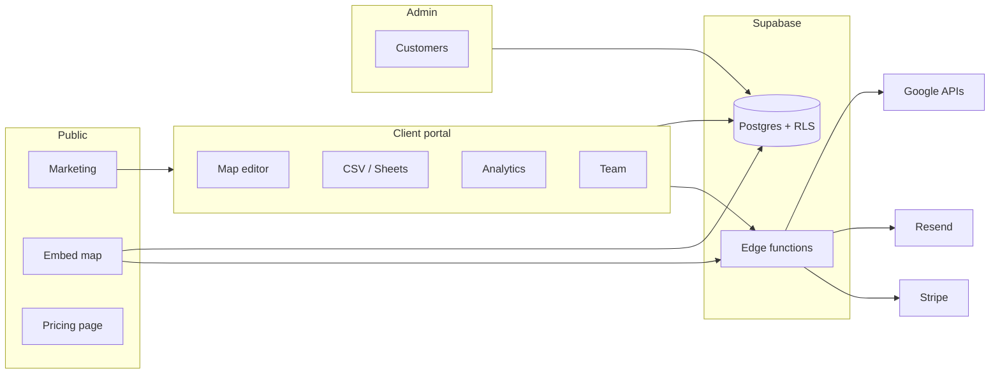

# Directory Maps — feature inventory

This document describes **all major features** in the application: what they do, who can use them, and where they live in the codebase. Use it for onboarding, beta planning, and support.

**Related:** [USER_GUIDE.md](./USER_GUIDE.md) (client how-to) · [BETA_READINESS.md](./BETA_READINESS.md) (launch gaps) · specialist docs linked per section.

---

## 1. Architecture overview

```mermaid
flowchart LR
  subgraph public [Public]
    Home[Marketing]
    Embed[Embed map]
    Pricing[Pricing page]
  end
  subgraph client [Client portal]
    Maps[Map editor]
    Data[CSV / Sheets]
    Stats[Analytics]
    Team[Team]
  end
  subgraph admin [Admin]
    Clients[Customers]
  end
  subgraph backend [Supabase]
    DB[(Postgres + RLS)]
    EF[Edge functions]
  end
  Home --> client
  client --> DB
  client --> EF
  Embed --> DB
  Embed --> EF
  admin --> DB
  EF --> Google[Google APIs]
  EF --> Resend[Resend]
  EF --> Stripe[Stripe]
```

**Tenancy model**

- **Organisation** = row in `clients` (name, slug, subscription flags, optional Resend domain).
- **User** = Supabase Auth account, linked via `contacts` (`client_id`, `role`, permissions).
- **Platform admin** = `profiles.role = 'admin'` (cross-tenant access via the admin portal).
- **Map** = belongs to one client; **listings** and **groups** belong to a map.

---

## 2. Public & marketing

| Feature | Route | Description | Key files |
|---------|-------|-------------|-----------|
| Landing page | `/` | Product overview, links to signup and admin | `src/pages/PublicMap.jsx` |
| Marketing pricing | `/pricing` | Static plan cards (Starter / Pro / Agency, GBP monthly) | `src/pages/Pricing.jsx` |
| Terms & conditions | `/terms` | Renders legal markdown | `src/pages/Terms.jsx`, `docs/MARKDOWN/...` |
| Privacy notice | `/privacy` | Renders legal markdown | `src/pages/Privacy.jsx`, `docs/MARKDOWN/...` |
| Site chrome | — | Header nav, footer, brand | `src/components/SiteHeader.jsx`, `SiteFooter.jsx` |
| Global error boundary | — | Catches uncaught React errors | `src/components/ErrorBoundary.jsx` |

**Note:** Marketing pricing (`Pricing.jsx`) is **not** the same as checkout plans in the publish flow (`PricingPlans.jsx` — Standard / Premium / Unlimited, yearly GBP). Align copy and plan IDs before public launch.

---

## 3. Authentication & account lifecycle

| Feature | Route | Description | Key files |
|---------|-------|-------------|-----------|
| Sign in | `/login` | Email/password; redirect after login; banners for verification / unlinked account | `src/pages/Login.jsx`, `AuthForm.jsx` |
| Sign up | `/signup` | Organisation name, auto slug, email/password; provisions `clients` + `contacts` | `src/pages/SignUp.jsx`, `provisionClientSignup.js` |
| Team invite signup | `/signup?invite=<uuid>` | Join existing org (no new org); email prefilled; password + verification | `inviteHelpers.js`, RPC `get_team_invitation_preview` |
| Team invite login | `/login?invite=<uuid>` | Existing users accept invite with password | `Login.jsx`, `acceptPendingInvitation` |
| Slug availability | — | RPC `is_client_slug_available` (timeout-tolerant) | `src/lib/authHelpers.js` |
| Forgot / reset password | `/forgot-password`, `/reset-password` | Supabase password recovery | respective pages |
| Email verification gate | `/client/*` | Portal blocked until `email_confirmed_at` | `src/components/ClientGate.jsx` |
| Session & admin role | — | Auth context, token refresh, signup provisioning mutex | `src/context/AuthContext.jsx`, `src/lib/auth.js` |
| Auth error redirect | — | Handles Supabase auth-error redirects (clean-path) | `src/Root.jsx` |

**Post-signup provisioning:** `provisionClientSignup` creates the organisation and primary contact from `user_metadata` (organisation name, slug). Skipped for team-invite signups (no `signup_org_*` metadata). **Team accept:** `acceptPendingInvitation` runs on every login before provisioning.

**Auth model:** Email + password everywhere. Email verification and password-reset use one-time links; there is no passwordless magic-link login.

---

## 4. Client portal

**Base route:** `/client` · **Gate:** signed-in user with verified email and linked `contacts` row.

### 4.1 Navigation & layout

| Feature | Route | Description |
|---------|-------|-------------|
| My Maps | `/client` | Dashboard grid of maps, data-source badges, links to stats |
| Team | `/client/team` | Manage organisation contacts (requires `can_manage_users` or primary) |
| Messaging | `/client/email` | Settings tab: enable/disable messaging, custom sending domain via Resend, contact-form prompt, email subject/opening line. **Sent messages** tab: paginated log of `map_contact_submissions` for the org (requires map-management permission) |
| Map sub-nav | `/client/maps/:id/*` | Design · Data · Stats |

Layout: `src/pages/client/ClientLayout.jsx` · Context: `ClientContext`, `getClientAndContact.js`.

### 4.2 Maps — create & list

| Feature | Description |
|---------|-------------|
| New map | Name, slug, default center/zoom, list panel, clustering |
| Map list | All maps for the organisation; open design, data, or stats |

Files: `ClientDashboard.jsx`, `ClientMapNew.jsx`, `MapsView.jsx`.

### 4.3 Map design & publish

The map editor (`ClientMapDashboard.jsx` / `AdminMapDashboard.jsx`) is a **live preview** with overlay panels. Design screens pass `showZoomSlider={false}` so the custom zoom/fullscreen control doesn’t cover the right-hand settings panel; published embeds keep the control. Bottom-left zoom indicator remains for setting default zoom.

| Panel | Purpose |
|-------|---------|
| **General** | Name, slug, **description** (long text, shown in the search panel), default lat/lng/zoom, list panel, clustering (auto-saved draft) |
| **Pin Design** | Marker style (pin/rounded pin/dot/custom icon), size, colour, border, favicon overlay, drop shadow; previews rendered at true map proportions. Custom icon (uploaded SVG/PNG) renders as-is — colour/border/shadow don't apply to it |
| **Panels** | Listing panel layout and content options |
| **Groups** | Group definitions and per-group theme JSON |
| **Map Style** | Presets + base type, colours, detail sliders, and overlay toggles |
| **Filters** | Define custom filter fields (single-select / multi-select / text), manage options + colours, and configure display (`show_in_filter_bar`, `display_control`, order). Definitions/options save immediately; display config is part of the draft→publish snapshot. Shared `FilterFieldsPanel.jsx` |
| **Publish Map** | Publish snapshot, version history, rollback, embed URL, subscription gate |
| **Search** | Search-panel logo upload + styling (panel background colour/transparency, **font colour** for title/description/labels/tabs/Key — not listing card text; listing background, border, transparency) + **Display options** (continent filter on/off, Key on/off); stored in `theme_json`, auto-saved draft. Includes a read-only summary of custom filter fields with a link to the **Filters** panel |

**Custom filter fields**

- Defined per map in the **Filters** panel (`FilterFieldsPanel.jsx`, shared by client + admin dashboards). Three field types: `single_select`, `multi_select`, `text`. Select types have colour-coded options.
- Values are tagged per listing (EAV rows in `listing_filter_values`) via the manual listing editor (`ListingFilterValuesEditor.jsx`), bulk edit (`BulkFilterEditModal.jsx`), CSV, or Google Sheets (`filter_<key>` columns).
- **Options auto-create on ingest:** CSV import (`ensureImportOptions` in `filterFields.js`) and Sheets sync (`sync_sheet_listings`) add any option value not already defined, so clients don't have to pre-enter categories. The viewer hides options with zero tagged listings (and select fields with no populated options).
- Display config (which fields show in the search bar, control type, order) flows through `buildPublicationConfig` and the CDN snapshot; matching is OR within a field, AND across fields (mirrors groups/continents).
- Data access + helpers: `src/lib/filterFields.js`. Admin events: `map_design_filter_field_*`, `data_filter_values_bulk_tagged`.

**Publication system**

- **Publish** calls RPC `publish_map` → stores versioned config in `map_publications`, sets `maps.published_at` and `published_config`.
- **Rollback** via `rollback_map_to` and publication list (`list_map_publications`).
- **Draft state** warns on navigation when unsaved; publish panel open state persists per map in `sessionStorage`.

Files: `mapPublication.js`, `MapDraftContext.js`, `publishPanelStorage.js`.

**Subscription gate (publish / embed):** `hasSubscriptionAccess` in `subscriptionAccess.js` — true if `clients.subscription_active_override`, or user email domain contains `layercake`. Stripe subscription status is **not** checked yet; checkout UI exists via `PricingPlans.jsx` + `create_checkout_session` edge function.

### 4.4 Data — listings

| Feature | Route | Description |
|---------|-------|-------------|
| Data hub | `/client/maps/:id/data` | CSV import, Google Sheets connect, sync schedule; **Manual entry** and **Map data** tabs filter by name/address; Manual entry re-geocodes lat/lng when the address changes |
| Listings table | `/client/maps/:id/listings` | Search/filter listings; batch geocode |

**CSV import**

- Template download; columns include `name`, `address`, `postcode`, `country`, `lat`, `lng`, `website_url`, `email`, `phone`, `logo_url`, `notes_html`, `group_name`, `is_active`, etc.
- If the map has active filter fields, the template adds a `filter_<key>` column per field (multi-select accepts pipe-`|`-delimited values); values not yet defined as options are auto-created on import.
- Optional **geocode rows missing lat/lng** (edge function `geocode_listings` / `geocode_address`).

**Google Sheets sync**

- OAuth via edge functions (`google_oauth_start`, `google_oauth_callback`).
- Pick sheet, validate columns (`validate_sheet_source`, which also reports `filter_<key>` header presence), sync rows (`sync_sheet_listings`, which resolves `filter_<key>` cells into `listing_filter_values`).
- Optional daily `pg_cron` schedule per map with selectable hour (displayed in local time, stored as UTC; Off / Daily in Data → Google Drive; see [GOOGLE_SHEETS_SYNC.md](./GOOGLE_SHEETS_SYNC.md)).

**Coming soon (UI only):** OneDrive / iCloud badges on data page.

**Sync history logging**

Every Google Sheets sync attempt is recorded in the `sync_logs` table (status: `running` → `success` / `warning` / `error`, row counts, error codes). A **Sync History** tab appears on the Data page when at least one log exists. The client dashboard shows a red **Sync errors detected** alert linking to the relevant map's Sync History tab when any error-status sync is present for the org.

Files: `ClientMapData.jsx`, `ClientMapListings.jsx`, `src/components/SyncHistoryTable.jsx`.

### 4.4a Directories (new, DIR-E1 core)

> **Visibility:** Directories and Categorisations are gated behind the `directories` **feature flag** (see §4.4c). They're hidden from customers by default; visible to platform admins, `@layercake-cx.biz` users, and any organisation an admin has granted early access. The nav items and the `/client/directories*` and `/client/categorisations` routes are both gated (`FeatureGate`).

A directory is the peer of a map — a browsable, structured list of entries not tied to a map. See `docs/DIRECTORIES.md` for the full product spec; only core CRUD (epic DIR-E1) plus categorisations (DIR-E5, see §4.4b) are built so far. Publishing, branding/custom domain, the entry layout designer, natural-language search, and map association/embedding are not implemented yet.

| Feature | Route | Description |
|---------|-------|-------------|
| Directories list | `/client/directories` | List/create directories for the client |
| Directory entries | `/client/directories/:directoryId` | Search, paginate, create/edit/delete entries; archive or permanently delete the directory; tag the directory and its entries with categorisation terms |

- Entry fields mirror the `listings` seed schema: name, address, postcode, country, city, lat/lng, website_url, email, phone, logo_url, notes_html, allow_html, group, is_active.
- **Directory groups** are a simple single-value grouping per directory (peer of `groups`) — distinct from the richer, client-wide categorisation model (§4.4b).
- Entry deletion (and directory deletion) require typing `DELETE` to confirm — a deliberate departure from the plain `window.confirm()` used for `listings`, given the larger blast radius of losing directory content.
- No CSV/XLSX import, bulk actions, or publishing yet — deferred to a fast-follow per the DIR-E1 scope decision.

Tables: `directories`, `directory_groups`, `directory_entries`, `contact_directory_permissions` (`20260714120000_create_directories.sql`). RLS mirrors `maps`/`groups`/`listings` (`_admin_all` + `_own_client`); no anon-read policy yet since there is no publish concept until DIR-E2.

Files: `src/lib/directories.js`, `src/components/directories/DirectoryEntriesPanel.jsx`, `ClientDirectories.jsx`, `ClientDirectoryNew.jsx`, `ClientDirectoryEntries.jsx` (client); `AdminDirectoryNew.jsx`, `AdminDirectoryEntries.jsx`, and a "Directories" tab in `AdminClientDetail.jsx` (admin).

### 4.4b Categorisations (new, DIR-E5)

Reusable, **client-wide** taxonomies (e.g. "Sector", "Region") that can be applied to whole directories, directory entries, or both — additive alongside directory groups, never a replacement (a categorisation can tag entries across every directory a client owns; a group is per-directory and single-value). Modelled directly on the existing `map_filter_fields`/`FilterFieldsPanel` pattern: `applies_to` is immutable after creation (delete and recreate to change it), archive vs. typed-`DELETE`-confirmation permanent delete (showing a live usage count across directories + entries).

| Feature | Route | Description |
|---------|-------|-------------|
| Categorisations | `/client/categorisations` (owners/managers) | Create/edit/archive/delete categorisations and their terms |
| Admin "Categorisations" tab | `/admin/clients/:clientId` | Same management UI, for Layercake staff |
| Entry tagging | Inside the entry create/edit modal on a directory's entries page | Checkbox picker per applicable categorisation |
| Directory tagging | On a directory's entries page, above the entries table | Checkbox picker, auto-saves on change |

Tables: `categorisations`, `category_terms`, `directory_category_terms`, `entry_category_terms` (`20260714130000_create_categorisations.sql`). RLS mirrors `directories`/`directory_entries` (`_admin_all` + `_own_client`, client-scoped via `categorisations.client_id` directly or a join); no anon-read policy yet.

Not built yet: public/published-site filtering by categorisation term (DIR-E5-S4) — requires directory publishing (DIR-E2), which doesn't exist yet.

Files: `src/lib/categorisations.js`, `src/components/directories/CategorisationsPanel.jsx`, `src/components/directories/CategoryTagPicker.jsx`, `ClientCategorisations.jsx` (client); a "Categorisations" tab in `AdminClientDetail.jsx` (admin).

### 4.4c Feature flags (new)

A generic feature-flag layer so in-development features can be tested in production and pre-released to named customers before general availability. Directories/Categorisations (§4.4a/§4.4b) is its first consumer.

| Concept | Where | Notes |
|---------|-------|-------|
| Flag registry | `feature_flags` table | One row per flag: `default_enabled` (global default), `internal_enabled` (auto-on for `@layercake-cx.biz`) |
| Per-org overrides | `feature_flag_overrides` table | One row grants/denies a flag for a single client — how a customer is let into a beta |
| Resolution | `get_my_feature_flags()` RPC (security definer) | Precedence: admin → internal (`@layercake-cx.biz` + `internal_enabled`) → per-org override → default |
| Admin control | Customer detail → **Feature access (beta)** | Toggle grants/clears the per-org override; emits `ops_feature_flag_changed` |

Resolution is **UI/route gating for unreleased features, not a security boundary** — the underlying tables keep their own tenant-scoped RLS. Flags fail closed: if the RPC errors, features stay hidden.

Files: `src/lib/featureFlags.js`, `src/context/featureFlagsContext.js`, `src/context/FeatureFlagsProvider.jsx`, `src/hooks/useFeatureFlags.js`, `src/components/FeatureGate.jsx`; provider mounted in `Root.jsx`; nav gating in `ClientLayout.jsx`; route gating in `App.jsx`; admin toggle in `AdminClientDetail.jsx`. Migration `20260805120000_create_feature_flags.sql`.

### 4.4d AI search enrichment (new, in development)

> **Visibility:** Admin-only for now (Layercake staff configure it on behalf of a client), gated behind the `ai_search` **feature flag** — same "Feature access (beta)" toggle pattern as Directories (§4.4c). Hidden from customers; visible to platform admins, `@layercake-cx.biz` users, and any client an admin has granted early access.

The foundational pipeline for Epic 2 (Intent-Based AI Search), plus the intent search query feature itself.

- Per-map admin setting (Map Settings → **Search** tab, when the flag is enabled for that client): a free-text prompt (`maps.ai_search_enrichment_prompt`) describing the structured research to capture per listing. This doubles as both the schema definition and the LLM instruction. Leaving it blank turns enrichment off for that map — no jobs are ever enqueued for a map without a prompt set.
- When a new listing is inserted on a map with a prompt configured, a trigger enqueues an async job (`listing_enrichment_jobs`, status `pending`). A `pg_cron` job (`process-listing-enrichment-dispatch`, every 2 minutes) claims a small batch via `claim_pending_listing_enrichment_jobs()` (`FOR UPDATE SKIP LOCKED` — safe under overlapping ticks) and dispatches to the `process_listing_enrichment` Edge Function, which calls Claude Haiku 4.5 (grounded to only the listing's existing directory content — instructed to use `null` rather than invent facts) and writes structured JSON to `listing_research`.
- Enrichment runs **once per listing, automatically, on insert only** — it never silently re-runs on update, to avoid burning tokens on every edit. A manual admin re-trigger (inserting a fresh `admin_manual` job row) is planned but not built yet.
- Batched polling (rather than firing a call per insert) deliberately throttles bulk CSV/Sheets imports, which can insert hundreds of listings at once.
- **Search query**: a visitor-facing "Ask AI" **chat** on the published/embed map (`search_listings_by_intent` Edge Function), separate from the existing plain-text substring search box. Multi-turn, not one-shot — the client sends the full conversation (`messages: [{role, content}]`) each call, and Claude Haiku 4.5 is instructed to ask one genuinely useful clarifying question when results are broad (e.g. asking location to narrow a country-wide match) rather than defaulting to it out of habit, and to stay warm and honest (not a dismissive "no" + unrelated follow-up) when a visitor's need genuinely isn't covered by the data. Every turn is forced via tool-call to return only listing ids plus a short reply — the function validates every returned id against the map's real listing set before responding, so a hallucinated id can never surface a listing that doesn't exist. Matching listings narrow both the map markers and the panel list each turn, and the map auto-fits bounds to the results. Visibility (`ai_search_enabled`) flows through the existing publish-snapshot pipeline (`buildPublicationConfig`/`normalizePublicationConfig`) — like other map settings, it only takes effect once published, not immediately on save. Only a boolean flows into the public config; the raw enrichment prompt text stays admin-only. The chat drawer and the pre-existing "Send message" drawer are mutually exclusive and both use `inert` while closed, to prevent a layout bug where a closed drawer's still-focusable content could get scrolled into view and push the whole embed off-screen.
- **Entitlement**: gated behind `features.maps.ai_search` (boolean) — Professional plan and above (`premium`/`unlimited`), or Founding Partner (`founder` pseudo-tier, automatic), plus the existing generic per-client override mechanism (`client_overrides` + the Entitlements tab in `AdminClientDetail.jsx` — no new admin UI code needed, it already manages any catalog feature generically). This is layered on top of, not instead of, the `ai_search` beta feature flag: the flag decides whether the admin UI can be configured at all for a client; the entitlement decides whether enrichment/search actually run. Enforced server-side in two places: the enrichment enqueue trigger (a client without the entitlement never gets a job queued, even if a prompt is still configured — e.g. after a downgrade) and the `search_listings_by_intent` Edge Function (defense in depth).

Not built yet: the manual "re-run enrichment" admin action, per-listing job-status visibility in the admin UI. External-LLM-facing structured data is now built — see §4.4e below.

Tables: `listing_enrichment_jobs`, `listing_research`, `maps.ai_search_enrichment_prompt` (`20260821120000_create_ai_search_enrichment.sql`); `claim_pending_listing_enrichment_jobs()` + cron dispatch (`20260821130000_ai_search_enrichment_worker_cron.sql`); `ai_search` flag seed (`20260821140000_seed_ai_search_feature_flag.sql`); `features.maps.ai_search` + `resolve_ai_search_entitlement()` resolver (`20260822120000_gate_ai_search_entitlement.sql`). RLS on the enrichment tables is admin-only (mirrors `feature_flags`) — the search feature reads `listing_research` via a service-role Edge Function, never directly from the client.

Files: `supabase/functions/process_listing_enrichment/index.ts`, `supabase/functions/search_listings_by_intent/index.ts`, `src/lib/aiSearch.js`; per-map prompt field in `AdminMapDashboard.jsx` (Search tab); beta toggle in `AdminClientDetail.jsx` ("Feature access (beta)" section); "Ask AI" UI in `PublishedMapView.jsx`; publish wiring in `lib/mapPublication.js` and `EmbedMap.jsx`. New third-party integration: Anthropic Claude API — see `docs/DATA_AND_PRIVACY.md` §10.

### 4.4e Directory & LLM/search discoverability (Epic 3, new, in development)

> **Visibility:** gated behind a new `directory_pages` beta feature flag (same "Feature access (beta)" toggle pattern) plus a dedicated commercial entitlement `features.maps.directory_pages` (Professional plan and above, or Founding Partner) — a distinct capability from `ai_search`, not bundled under it, even though its richest content reuses `ai_search`'s enrichment data where available.

Prompted by testing Epic 2 with an external LLM: the app is a pure client-rendered SPA, so a normal web crawl (or an LLM's URL-fetch tool) sees only a loading shell — no real listing content, no structured data. This epic makes published maps crawlable without adding server-side rendering to the app itself.

- New canonical public URLs per map: `/:clientSlug/:mapSlug/directory` (landing page) and `/:clientSlug/:mapSlug/directory/:listingSlug` (per listing) — required adding a `listings.slug` column (url-safe, unique per map, auto-generated from name on insert via a DB trigger regardless of which pathway creates the listing — manual entry, CSV import, Sheets sync — and backfilled for existing listings).
- **Generation**: a new `generate_directory_pages` Edge Function (same fire-on-publish + nightly-cron trigger pattern as `generate_map_snapshot`) builds real static HTML — a directory landing page (full-width embedded interactive map, thin header with logo + title, listings + group/filter badges below) and one page per listing (schema.org `LocalBusiness` JSON-LD, content from `listing_research` when present, falling back to `notes_html`) — plus a per-map `sitemap.xml`. Research JSON is rendered generically (recursive definition list) since its shape is whatever that map's own enrichment prompt asked for, not a fixed schema.
- **Serving**: `middleware.js` (repo root) — the first Vercel Edge Middleware this app has used. Intercepts exactly `/:clientSlug/:mapSlug/directory[/:listingSlug]`, fetches the pre-generated HTML from the same Vercel Blob store `generate_map_snapshot` already uses, and returns it directly — before the request ever reaches `vercel.json`'s SPA rewrite to `index.html`. Every other path (including the plain interactive `/:clientSlug/:mapSlug` route) is untouched. Same content to every visitor and every crawler — no user-agent sniffing/cloaking.
- Deliberately scoped to a **per-map** `sitemap.xml`, not one root-level sitemap aggregating every client — safely merging concurrent publishes from different maps into one shared file was judged not worth the complexity for v1.
- While building this, testing surfaced and fixed a real, previously-silent bug in Epic 2's enrichment: `max_tokens: 1024` was truncating Claude's response for any map with an elaborate enrichment prompt, producing an empty `{}` result with no error anywhere (now `4096`, plus a hard failure instead of silently accepting empty/truncated data).

Not built yet: root-level combined sitemap, curated (vs. fully generic) rendering of research content — some clearly internal/editorial fields (e.g. a `gaps` or `recommended_inclusion` field an admin's own prompt might produce) currently render on the public page along with genuine content, since the renderer can't know which fields are meta vs. content for an arbitrary admin-defined schema.

Tables/functions: `listings.slug` + `generate_unique_listing_slug()` + insert trigger (`20260822200000_add_listings_slug.sql`); `directory_pages` flag seed (`20260822210000_seed_directory_pages_feature_flag.sql`); `features.maps.directory_pages` + `resolve_directory_pages_entitlement()` (`20260822220000_gate_directory_pages_entitlement.sql`).

Files: `supabase/functions/generate_directory_pages/index.ts`, `middleware.js`; publish wiring (`triggerDirectoryPagesRegeneration`) in `src/lib/mapPublication.js`, `AdminMapDashboard.jsx`, `ClientMapDashboard.jsx`.

### 4.4f Custom domains — "Bring Your Own Domain" (Epic 4, new, in development)

> **Visibility:** gated behind a new `custom_domain` beta feature flag (same "Feature access (beta)" toggle pattern) plus a dedicated commercial entitlement `features.maps.custom_domain` (Professional plan and above, or Founding Partner). Favicon config and baseline SEO metadata quality (later phases of this epic) are deliberately **not** tier-gated — only the custom domain itself and its attached Google Analytics config are.

Lets a client point a domain or subdomain they own at one of their maps, verify it, and publish to it — verified end-to-end against a real domain on staging.

- **Data model** (Phase 0): `client_domains` table — one domain maps to exactly one map (`map_id` not null); a client may register several domains, and more than one may point at the same map. `status` lifecycle: `pending` → `verifying`/`active`/`failed`. `dns_records` jsonb holds the required TXT (ownership) + routing (A or CNAME) records, mirroring the shape of `clients.email_dns_records` for Resend. `ga_measurement_id` is per-domain, for a later phase.
- **Verification & Vercel attachment** (Phases 1–2, `manage_client_domain` Edge Function): a client adds a hostname (validated format, uniqueness, chosen map ownership); the function generates a TXT ownership-proof record plus a routing record — **A record → `76.76.21.21` for an apex/root domain, CNAME → `cname.vercel-dns.com` for a subdomain** (apex domains can't legally carry a CNAME — DNS spec, not a Vercel quirk). Our own TXT check runs via **Cloudflare's public DNS-over-HTTPS API** (no credential needed); once that passes, the domain is added to the Vercel project via the Domains API, then checked against **Vercel's own authoritative `GET /v6/domains/{domain}/config` (`misconfigured`)** rather than re-resolving DNS ourselves — that endpoint correctly handles apex-domain CNAME-flattening (a plain A/CNAME re-lookup does not: verified in testing that a Cloudflare-flattened apex CNAME resolves to different, but equally valid, Vercel IPs than a fresh lookup of the routing target, which would have failed a naive equality check). Both TXT-verified and Vercel-configured moves status to `active`.
- **Host-based routing** (Phase 2, `middleware.js`): branches on the request's `Host` header. Branded domain (`maps.layercake-cx.biz`, `*.vercel.app`) — unchanged since Epic 3. Any other host — resolved via a new `resolve_custom_domain(hostname)` RPC (security definer, returns only client/map slugs + status; deliberately **not** solved by granting `anon` select on `clients`, which has picked up sensitive columns — `plan_key`, `email_domain_status` — since `maps`/`groups`/`listings` got their anon-read policies) — then routed per the decided scheme: `/` → directory landing (same Vercel Blob content Epic 3 generates), `/:listingSlug` → listing page, `/map` → falls through to the SPA, where a new `/map` route (`CustomDomainMap.jsx`) resolves the map by hostname and renders the existing `/embed` view — so the URL doubles as a real iframe source. An unresolvable or not-yet-active domain gets an honest static response, not the branded domain's own content.
- Client portal: `/client/domains` (`ClientDomains.jsx` → shared `DomainSettings.jsx`, same client/admin-parity pattern as Messaging). Admin: a "Domains" tab on `AdminClientDetail.jsx` using the same shared component.
- Full epic scope (per-domain Google Analytics, generalized SEO metadata, favicon config) and the phase breakdown live in the epic planning doc (Monday: "Bring Your Own Domain (Epic 4)").

Not built yet: generalized SEO metadata/canonical-URL resolution per custom domain (Phase 3), favicon config (Phase 4), Google Analytics injection (Phase 5). Phases 0–2 are deployed to both staging and production — the feature is flag-gated and no production client is using it yet, but the mechanism itself is live and confirmed working via real Vercel edge routing.

Tables/functions: `client_domains` (`20260824120000_create_client_domains.sql`); `maps.favicon_url` (`20260824121000_add_maps_favicon_url.sql`, unused until Phase 4); `custom_domain` flag seed (`20260824122000_seed_custom_domain_feature_flag.sql`); `features.maps.custom_domain` + `resolve_custom_domain_entitlement()` (`20260824123000_gate_custom_domain_entitlement.sql`); `resolve_custom_domain()` (`20260824130000_add_resolve_custom_domain_rpc.sql`).

Files: `supabase/functions/manage_client_domain/index.ts`, `supabase/functions/_shared/dns.ts`, `supabase/functions/_shared/vercel.ts`; `middleware.js`; `src/pages/CustomDomainMap.jsx`, `src/components/DomainSettings.jsx`, `src/pages/client/ClientDomains.jsx`, `src/lib/clientDomains.js`.

### 4.5 Analytics (engagement)

| Feature | Route | Description |
|---------|-------|-------------|
| Map stats | `/client/maps/:id/stats` | Sessions, funnel, charts, search terms, date range |
| Listing stats | `.../stats/listings/:listingId` | Per-listing engagement breakdown |

Data source: `map_engagement_events` (recorded on **public embed only**). See [MAP_ENGAGEMENT.md](./MAP_ENGAGEMENT.md).

Files: `MapStats.jsx`, `ListingStats.jsx`, `src/hooks/useListingEngagement.js`, `src/components/engagement/*`.

### 4.6 Team & permissions

**Route:** `ClientTeam.jsx` at `/client/team` (owners/managers via `canManageOrg`).

| Capability | Description |
|------------|-------------|
| List team | Contacts with roles (owner / manager / member) |
| Invite | Edge `send_team_invitation` — validates 1:1 account rule, emails signup link (Resend) |
| Member map access | Per-map checkboxes; stored in `contact_map_permissions` |
| Accept invite | Invitee signs up/logs in with password; RPC `accept_team_invitation` on session |

Legacy `ClientUsers.jsx` (manual contact insert only) remains in the repo but is not routed.

**Permission model (coexisting)**

- Legacy: `is_primary`, `can_manage_maps`, `can_manage_users` on `contacts`.
- New: `role` (`owner` | `manager` | `member`) + `contact_map_permissions` for member map scope.

### 4.7 Custom email (Resend)

| Feature | Route | Description |
|---------|-------|-------------|
| Domain setup | `/client/email` | Add DNS records, verify domain, set from-address; **Setup instructions** copies email text for DNS suppliers |

Edge function: `manage_client_email`. See [RESEND_EMAIL.md](./RESEND_EMAIL.md).

---

## 5. Public embed (visitor experience)

| Feature | Route | Description |
|---------|-------|-------------|
| Embed map | `/embed?map=<MAP_ID>` | Full-screen published map; requires `published_at` |
| Search panel | — | Flush top-left, full-height panel: logo, title, description, search box, group **filter lozenges**, colour key, and an alphabetical listings list (logo, name, city/country, group label) |
| Search | — | Places + listing search; engagement events logged |
| Group filtering | — | Lozenge tags filter listings + markers by group (multi-select); colour key legend |
| Continent filtering | — | Optional continent chips (derived from listing country) filter listings + markers; combines with group filters |
| Custom filter fields | — | Per-map configurable filters (dropdown / checkbox lozenges / typeahead) shown when `show_in_filter_bar`; OR within a field, AND across fields; logged as `directory_custom_filter` |
| Listing detail | — | Panel from marker, list, or search |
| Contact visitor | — | “Send message” → `map_contact_submissions` + email via Resend |
| Marker clustering | — | Configurable cluster radius; same-address clusters auto-spiderfy (fan out) on click |

Files: `EmbedMap.jsx`, `PublishedMapView.jsx`, `DirectoryMap.jsx`, `contactMessage.js`, `mapEngagement.js`.

**Engagement:** Anonymous insert-only RLS on `map_engagement_events` for published maps. Failures are non-blocking (`console.warn`).

---

## 6. Admin console

**Base route:** `/admin` · **Gate:** `profiles.role = 'admin'`.

| Feature | Route | Description |
|---------|-------|-------------|
| Customers | `/admin/clients` | Search, create, delete clients |
| Customer detail | `/admin/clients/:id` | Edit org, contacts, maps; `subscription_active_override`; secondary client nav (Maps · Customer details · Users · Messaging); **Messaging tab** matches client portal (Settings + Sent messages) |
| New customer | `/admin/clients/new` | Create organisation (name + slug) |
| Add customer user | `/admin/clients/:id` (Users tab) | Send invite to create account/set password; contact links after invite acceptance |
| Contact detail | `/admin/clients/:id/contacts/:contactId` | Per-contact admin view |
| All maps | `/admin/maps` | Cross-tenant map search |
| Per-client maps | `/admin/clients/:id/maps/...` | Same tools as client portal (design, data, stats, listings) |
| Legacy listings | `/admin/listings` | Global listing browser (limit 1000) |
| Admin users | `/admin/users` | List admin users; open profile with Details and Activities tabs |
| Leads | `/admin/leads` | **Deprecated (2026-07-07):** the public landing page form now submits to HubSpot, so this page only shows historical enquiries captured in `beta_signups` before the switch — no new rows arrive. Name, email, organisation, submission date; admin-editable status (To be actioned / In progress / Successful / Lost) |
| Logs ▾ User activity | `/admin/user-activity` | Filterable audit log (`admin_events`: type, subtype, client, map) |
| Logs ▾ Error log | `/admin/error-log` | Client-reported errors in `error_logs` |
| Logs ▾ Sync log | `/admin/sync-log` | Google Sheets/Drive sync run history |
| Deployments | `/admin/deployments` | Trigger Vercel deploy hooks or copy shell commands |

Admins manage each customer through the admin pages (`/admin/clients/:id`), which mirror the client portal views (maps, directories, categorisations, users, messaging). Client impersonation was removed on 2026-08-05.

Files: `src/pages/admin/*`, `AdminGate.jsx`, `clientAuth.js`.

---

## 7. Backend (Supabase)

### 7.1 Core tables

| Table | Purpose |
|-------|---------|
| `clients` | Organisations (slug, subscription override, Resend fields) |
| `contacts` | Users linked to clients (role, permissions) |
| `profiles` | Auth user metadata; `role = admin` for platform admins |
| `maps` | Map config, publish timestamps, theme, pins, clustering |
| `groups` | Listing groups + theme JSON |
| `listings` | Locations / directory entries (geocode status, `geocoded_at`) |
| `map_filter_fields` | Custom filter field definitions per map (type, display config, order) |
| `map_filter_field_options` | Options (value/label/colour) for select-type filter fields |
| `listing_filter_values` | EAV tags linking listings to filter options / text values |
| `map_data_sources` | Google Sheet binding + sync schedule |
| `map_publications` | Versioned publish snapshots |
| `map_engagement_events` | Embed analytics |
| `map_contact_submissions` | Visitor contact form archive |
| `invitations` | Pending team invites |
| `contact_map_permissions` | Member → map access |
| `directories` | New Directories feature (peer of `maps`) — DIR-E1 core only |
| `directory_groups` | Simple single-value grouping per directory (peer of `groups`) |
| `directory_entries` | Directory entries (peer of `listings`) |
| `contact_directory_permissions` | Member → directory access (peer of `contact_map_permissions`, not yet RLS-enforced — mirrors current `contact_map_permissions` behaviour) |
| `categorisations` | Client-wide taxonomy definitions (key, label, `applies_to`) |
| `category_terms` | Term list per categorisation (peer of `map_filter_field_options`) |
| `directory_category_terms` | Tags a whole directory with a term |
| `entry_category_terms` | Tags a directory entry with a term (peer of `listing_filter_values`, pure many-to-many) |
| `feature_flags` | Feature-flag registry (`default_enabled`, `internal_enabled`); resolved by `get_my_feature_flags()` |
| `feature_flag_overrides` | Per-organisation flag grants/denials (pre-release a beta to specific customers) |
| `error_logs` | Client-side error reports |

View: `public_listings` for anon-safe listing reads on embed.

### 7.2 Security (RLS)

| Migration | Purpose |
|-----------|---------|
| `20260315100000_enable_rls_policies.sql` | Initial RLS |
| `20260520100000_tenant_scoped_rls.sql` | **Tenant-scoped** policies via `current_user_client_id()` |
| `20260521100000_fix_profiles_rls_recursion.sql` | `is_admin()` security definer helper |
| `20260522100000_data_api_grants.sql` | Explicit API grants; RLS remains enforcement |

**Pre-launch:** Ensure tenant-scoped RLS and profile recursion fix are applied on **production** Supabase (migrations may exist only locally until pushed).

### 7.3 RPCs

| Function | Purpose |
|----------|---------|
| `is_client_slug_available` | Signup slug check |
| `get_team_invitation_preview` | Public invite details for signup/login pages (anon) |
| `create_team_invitation` | Owner/manager creates pending invite |
| `accept_team_invitation` | Links logged-in user to org from pending invite |
| `current_user_client_id` | RLS helper |
| `is_admin` | RLS helper |
| `publish_map` | Create publication + update published config |
| `rollback_map_to` | Restore a prior publication |
| `list_map_publications` | Version history for UI |

### 7.4 Edge functions

| Function | Purpose |
|----------|---------|
| `geocode_address` | Single-address geocode |
| `geocode_listings` | Batch geocode for a map |
| `google_oauth_start` / `google_oauth_callback` | Sheets OAuth |
| `google_get_access_token` | Token refresh for sync + short-lived token for Google Picker |
| `google_set_sheet_file` | Save the file picked via Google Picker |
| `google_list_sheets` | Deprecated — superseded by Google Picker |
| `validate_sheet_source` | Column validation |
| `sync_sheet_listings` | Import + geocode from sheet |
| `send_contact_message` | Resend email from embed form |
| `manage_client_email` | Resend domain CRUD |
| `create_checkout_session` | Stripe Checkout |
| `admin_create_client_user` | Admin user invite: create invitation + onboarding email to signup flow |
| `admin_delete_client_user` | Admin user removal: delete contact + auth user (blocked if linked to other clients) |

Shared utilities: `supabase/functions/_shared/`.

---

## 8. Integrations summary

| Service | Used for | Config |
|---------|----------|--------|
| **Google Maps JS** | Map display, embed | `VITE_GOOGLE_MAPS_API_KEY` |
| **Google Geocoding** | CSV/Sheets/listings | `GOOGLE_GEOCODING_API_KEY` (edge) |
| **Google Drive/Sheets** | Live data sync | OAuth secrets on edge functions |
| **Supabase** | Auth, DB, functions | `VITE_SUPABASE_*` |
| **Resend** | Contact emails, custom domains | `RESEND_API_KEY`, per-client domain |
| **Stripe** | Checkout sessions | Stripe secrets on `create_checkout_session` |
| **Vercel** | Hosting, deploy hooks | `vercel.json`, optional hook env vars |

---

## 9. Operational & developer features

| Feature | Description |
|---------|-------------|
| Client error logging | `errorLogger.js` → `error_logs` (global handlers, recursion guard) |
| Deploy scripts | `npm run deploy:test`, `deploy:live` |
| Geocode test script | `scripts/test-geocode.mjs` |
| Environments | [ENVIRONMENTS_SETUP.md](./ENVIRONMENTS_SETUP.md) |
| Deploy guide | [DEPLOY.md](./DEPLOY.md) |

---

## 10. Feature maturity matrix

| Area | Status | Notes |
|------|--------|-------|
| Map design & publish | **Production-ready** | Versioned publications, rollback |
| Custom filter fields | **Beta** | Schema + admin panel + viewer + CSV/Sheets tagging shipped; staging-first migrations pending production apply |
| CSV import & geocode | **Production-ready** | Depends on edge deploy + API keys |
| Google Sheets sync | **Production-ready** | Documented; cron optional |
| Public embed | **Production-ready** | Requires publish + keys |
| Engagement recording | **Production-ready** | Best-effort inserts |
| Engagement dashboards | **Production-ready** | Client portal Stats routes |
| Team (invitations + roles) | **Production-ready** | `ClientTeam` + `acceptPendingInvitation` on login |
| Stripe subscription enforcement | **Incomplete** | Checkout exists; `hasSubscriptionAccess` ignores Stripe |
| Marketing vs checkout pricing | **Misaligned** | Two plan catalogs |
| Admin user management | **Stub** | Page is placeholder |
| OneDrive / iCloud | **Not started** | UI placeholders only |
| Tenant RLS migrations | **Deployed** | Production + test; smoke-test cross-tenant access |
| Directories (DIR-E1 core) | **Beta (flagged)** | Directory + entry CRUD shipped to staging; hidden behind the `directories` feature flag; no publish/branding/search/map-linking yet (see `docs/DIRECTORIES.md`) |
| Categorisations (DIR-E5) | **Beta (flagged)** | Taxonomy management + directory/entry tagging shipped to staging; hidden behind the `directories` feature flag; no published-site filtering yet (depends on DIR-E2 publishing) |
| Feature flags | **Deployed** | Registry + per-org overrides + `get_my_feature_flags()` resolver; admin toggle on customer detail; used to gate Directories/Categorisations |
| Entitlements (plans/features/overrides) | **Deployed** | `products`/`plans`/`features`/`plan_features`/`client_overrides` + `get_my_entitlements()`/`get_client_entitlements()` resolvers; server-side enforcement (triggers on `maps`/`contacts`/`listings`, view-level gate for messaging); admin Entitlements tab for plan assignment + per-client overrides; shared `EntitlementGate`/`EntitlementUsageHint` UI kit. Catalog so far: `max_maps`, `messaging`, `seats`, `data_rows` |
| Add-ons (buy more seats/rows/etc.) | **Not started** | Planned: let customers purchase additional seats, data rows, etc. beyond their plan's included amount. The `client_overrides` mechanism can already represent "this client gets more than their plan default" (that's how admin-granted grants and messaging grandfathering work today) — an add-ons feature would need a self-serve purchase flow (Stripe) that creates/extends the right override automatically, plus a way to distinguish a *purchased* add-on from an *admin-granted* one (billing implications, renewal/expiry, invoicing) |
| Intent-Based AI Search (Epic 2) | **Deployed (flagged)** | Enrichment pipeline (job queue, cron worker, Claude Haiku 4.5) + multi-turn intent search-query chat (hallucination-guarded id validation, map auto-fit) + `maps.ai_search` entitlement (Professional plan+/Founding Partner, per-client override, server-side enforced) deployed to staging + production; hidden behind the `ai_search` feature flag. No admin re-run action, no job-status UI yet |
| Directory & LLM/Search Discoverability (Epic 3) | **Deployed (flagged)** | Crawlable per-listing + directory landing pages (schema.org JSON-LD, embedded interactive map, sitemap.xml) via a new Vercel Edge Middleware + `generate_directory_pages` Edge Function, deployed to staging + production; hidden behind the `directory_pages` feature flag + its own `maps.directory_pages` entitlement. No root-level combined sitemap, no curated (vs. fully generic) research rendering yet |
| Bring Your Own Domain (Epic 4) | **Deployed to staging + production (flagged), Phases 0–2 of 6** | Domain registration, DNS verification, Vercel domain attachment, and host-based routing (`middleware.js` + `resolve_custom_domain()` RPC), behind the `custom_domain` feature flag (off by default) + `maps.custom_domain` entitlement. Verified end-to-end against a real domain on staging; verified via real Vercel edge routing on production (hitting an attached-but-unregistered-in-prod domain correctly returned the app's own fallback, not a Vercel error). No production client has used this yet — the flag is off for everyone by default. SEO metadata generalization, favicon, and Google Analytics are Phases 3–5, not started |

---

## 11. Route reference

| Path | Component |
|------|-----------|
| `/` | `PublicMap` |
| `/pricing` | `Pricing` |
| `/login`, `/signup`, `/forgot-password`, `/reset-password` | Auth pages |
| `/terms` | `Terms` |
| `/privacy` | `Privacy` |
| `/embed` | `EmbedMap` |
| `/map` | `CustomDomainMap` (resolves the map by request hostname; only meaningful on a verified custom domain) |
| `/client` | `ClientDashboard` |
| `/client/team` | `ClientTeam` |
| `/client/email` | `ClientEmail` |
| `/client/domains` | `ClientDomains` (flagged: `custom_domain`) |
| `/client/maps/new` | `ClientMapNew` |
| `/client/maps/:mapId` | `ClientMapDashboard` |
| `/client/maps/:mapId/data` | `ClientMapData` |
| `/client/maps/:mapId/listings` | `ClientMapListings` |
| `/client/maps/:mapId/stats` | `MapStats` |
| `/client/maps/:mapId/stats/listings/:listingId` | `ListingStats` |
| `/client/directories` | `ClientDirectories` |
| `/client/directories/new` | `ClientDirectoryNew` |
| `/client/directories/:directoryId` | `ClientDirectoryEntries` |
| `/client/categorisations` | `ClientCategorisations` |
| `/admin/clients` | `AdminClients` |
| `/admin/maps` | `AdminMaps` |
| `/admin/clients/:clientId/maps/:mapId` | `AdminMapDashboard` |
| `/admin/clients/:clientId/maps/:mapId/stats` | `AdminMapStats` |
| `/admin/clients/:clientId/maps/:mapId/stats/listings/:listingId` | `AdminListingStats` |
| `/admin/clients/:clientId/directories/new` | `AdminDirectoryNew` |
| `/admin/clients/:clientId/directories/:directoryId` | `AdminDirectoryEntries` |
| `/admin/user-activity` | `AdminUserActivity` |
| `/admin/error-log` | `AdminErrorLogs` |
| `/admin/deployments` | `AdminDeployments` |

Full route tree: `src/App.jsx`.
