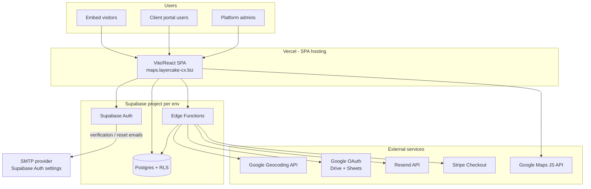

# Integration architecture & secrets inventory

This document describes how **Directory Maps** connects to external systems, what each integration does, and **which credentials belong in a secrets vault** (per environment: test and production).

**Related:** [ENVIRONMENTS_SETUP.md](./ENVIRONMENTS_SETUP.md) · [DEPLOY.md](./DEPLOY.md) · [`.env.example`](../.env.example)

---

## 1. System context



**Pattern:** The browser holds only **public** Supabase keys (`anon`). Privileged work runs in **Edge Functions** with the **service role** and third-party API secrets. **Row Level Security (RLS)** enforces tenant boundaries in Postgres.

---

## 2. Application layers

| Layer | Technology | Role |
|-------|------------|------|
| Frontend | Vite 7, React 19, React Router (HashRouter) | SPA: marketing, client portal, admin, embed |
| Hosting | Vercel (primary) or GitHub Pages (alternate) | Static build (`dist/`), env at build time |
| API / data | Supabase Postgres | Maps, listings, clients, contacts, engagement, invitations |
| Auth | Supabase Auth | Email + password; email verification; password reset |
| Serverless API | Supabase Edge Functions (Deno) | Geocode, Google sync, email, Stripe, team invites |
| Maps UI | Google Maps JavaScript API | Map tiles, markers, clustering |
| Geocoding | Google Geocoding API (server) | CSV import, listings geocode, sheet sync |
| Sheets | Google Drive + Sheets APIs | Live listing sync via OAuth refresh tokens |
| Email (app) | Resend REST API | Embed contact form, team invitations, optional client domains |
| Billing (partial) | Stripe Checkout | Subscription sessions; enforcement still partial in app |
| Cron (optional) | `pg_cron` + `pg_net` + Supabase Vault | Hourly dispatch of `sync_sheet_listings` for maps with a matching `sync_schedule = daily:HH:00` |

---

## 3. Integration flows (summary)

| Flow | Trigger | Integrations |
|------|---------|--------------|
| Sign up / login | User | Supabase Auth |
| Client portal CRUD | Authenticated user | Supabase client + RLS |
| Publish map | Client | RPC `publish_map` (Postgres) |
| Public embed | Visitor | Anon read published config/listings; optional engagement + contact form |
| CSV geocode | Client | Edge `geocode_listings` / `geocode_address` → Google Geocoding |
| Google Sheets connect | Client | Edge OAuth start/callback → tokens in `map_data_sources` |
| Sheet sync | Manual or cron | Edge `sync_sheet_listings` → Google Sheets + Geocoding |
| Contact form | Embed visitor | Edge `send_contact_message` → Resend |
| Team invite | Owner/manager | Edge `send_team_invitation` → Resend + Postgres `invitations` |
| Custom email domain | Client | Edge `manage_client_email` → Resend Domains API |
| Checkout | Client | Edge `create_checkout_session` → Stripe |
| Deploy from admin | Admin | Vercel Deploy Hook URL (optional, in frontend env) |

---

## 4. Edge Functions reference

| Function | JWT at gateway | Auth inside | External APIs |
|----------|----------------|-------------|---------------|
| `geocode_address` | Often `--no-verify-jwt` | None / public | Google Geocoding |
| `geocode_listings` | Service | Service role | Google Geocoding |
| `google_oauth_start` | User JWT | User session | Google OAuth |
| `google_oauth_callback` | User JWT | User session | Google OAuth |
| `google_get_access_token` | User JWT | Map access | Google token refresh |
| `google_list_sheets` | User JWT | Map access | Google Drive/Sheets |
| `google_set_sheet_file` | User JWT | Map access | Google Sheets |
| `validate_sheet_source` | User JWT | Map access | Google Sheets |
| `sync_sheet_listings` | Varies | Service / cron | Google Sheets + Geocoding |
| `send_contact_message` | `--no-verify-jwt` | Public + RLS context | Resend |
| `manage_client_email` | `--no-verify-jwt` | User JWT inside | Resend |
| `send_team_invitation` | User JWT | Owner/manager | Resend + RPC |
| `create_checkout_session` | User JWT | User + contact | Stripe |

Deploy notes: [RESEND_EMAIL.md](./RESEND_EMAIL.md), [GOOGLE_SHEETS_SYNC.md](./GOOGLE_SHEETS_SYNC.md), [ENVIRONMENTS_SETUP.md](./ENVIRONMENTS_SETUP.md).

---

## 5. Critical runtime dependencies

These must be available for core product behaviour. Treat outages as **P1**.

| Dependency | Used for | If missing / down |
|------------|----------|-------------------|
| **Supabase** (project URL + anon key) | All auth and data | App unusable |
| **Supabase Auth** | Login, signup, verification | No client/admin access |
| **Postgres + RLS** | Multi-tenant data | Data wrong or blocked |
| **Google Maps JavaScript API** | Map designer + embed | Blank maps |
| **Vercel** (or host) | Serve SPA | Site unavailable |

**High importance (feature-specific):**

| Dependency | Used for | If missing |
|------------|----------|------------|
| Google Geocoding API | Address → lat/lng | Import/geocode fails |
| Resend API | Contact email, team invites | Forms save; email fails |
| Edge Functions (deployed) | Geocode, email, Google, Stripe | Feature errors in UI |
| Supabase **service role** (Edge only) | Privileged server operations | Edge functions fail |

**Optional / partial:**

| Dependency | Used for |
|------------|----------|
| Google OAuth + Sheets | Sheet sync only |
| Stripe | Checkout UI; subscription gate not fully wired |
| Vercel Deploy Hooks | Admin one-click deploy |
| `pg_cron` | Scheduled sheet sync |
| GitHub Pages workflow | Alternate hosting path |

---

## 6. NPM dependencies (build-time)

Not vault secrets; pin in `package-lock.json` / `npm ci`.

| Package | Purpose |
|---------|---------|
| `@supabase/supabase-js` | Browser Supabase client |
| `@googlemaps/markerclusterer` | Marker clustering |
| `react`, `react-dom`, `react-router-dom` | UI |
| `@mantine/core`, `@mantine/hooks` | UI components |
| `recharts` | Stats charts |
| `react-markdown`, `remark-gfm` | Terms page |
| `vite`, `@vitejs/plugin-react` | Build (dev) |

---

## 7. Secrets & keys — vault inventory

Store **separate values for test and production**. Never commit secrets to git.

Legend:

- **Sensitivity:** `PUBLIC` = safe in browser bundle; `SECRET` = vault only; `PRIVILEGED` = bypasses RLS — highest care
- **Where:** primary store (Vercel env, Supabase secrets, Supabase Dashboard, Supabase Vault, GitHub Actions secrets)

### 7.1 Frontend (Vercel / build-time)

Injected at **build** via `VITE_*` (embedded in client JS). Only use `VITE_` for non-sensitive or intentionally public keys.

| Name | Sensitivity | Required | Where to store | Purpose |
|------|-------------|----------|----------------|---------|
| `VITE_SUPABASE_URL` | PUBLIC | Yes | Vercel, GitHub Actions | Supabase project URL |
| `VITE_SUPABASE_ANON_KEY` | PUBLIC* | Yes | Vercel, GitHub Actions | Supabase anon key (*public by design; RLS must protect data) |
| `VITE_GOOGLE_MAPS_API_KEY` | PUBLIC* | Yes | Vercel, GitHub Actions | Maps JS in browser (*restrict by HTTP referrer in Google Cloud) |
| `VITE_GOOGLE_API_KEY` | PUBLIC* | Optional | Vercel | Google Picker (Sheets UI); can equal Maps key |
| `VITE_ENVIRONMENT` | PUBLIC | Optional | Vercel | Label only (`preview` / `production`) |
| `VITE_BASE_PATH` | PUBLIC | Optional | Vercel | Subpath deploys only (e.g. GitHub Pages) |
| `VITE_DEPLOY_HOOK_PREVIEW` | SECRET | Optional | Vercel | Vercel deploy hook URL (test/preview) |
| `VITE_DEPLOY_HOOK_PRODUCTION` | SECRET | Optional | Vercel | Vercel deploy hook URL (production) |

**Vault recommendation:** Store Maps API key in vault even though it is bundled — use Google Cloud **API key restrictions** (referrer + APIs). Rotate if leaked.

### 7.2 Supabase Edge Function secrets

Set per project: `supabase secrets set KEY=value --project-ref <ref>` or Dashboard → Edge Functions → Secrets.

| Name | Sensitivity | Required | Purpose |
|------|-------------|----------|---------|
| `SUPABASE_URL` | PUBLIC | Auto / yes | Same as project URL (often auto-injected) |
| `SUPABASE_ANON_KEY` | PUBLIC | Auto / yes | Anon key for user-scoped clients in functions |
| `SUPABASE_SERVICE_ROLE_KEY` | **PRIVILEGED** | Yes | Bypasses RLS — server-only |
| `GOOGLE_GEOCODING_API_KEY` | SECRET | Yes** | Server-side geocode (**or** fallback `GOOGLE_MAPS_API_KEY` in some functions) |
| `GOOGLE_MAPS_API_KEY` | SECRET | Optional | Fallback for geocode functions |
| `GOOGLE_OAUTH_CLIENT_ID` | SECRET | For Sheets | OAuth client ID |
| `GOOGLE_OAUTH_CLIENT_SECRET` | SECRET | For Sheets | OAuth client secret |
| `GOOGLE_OAUTH_REDIRECT_URI` | PUBLIC | For Sheets | Must match Google Cloud console |
| `RESEND_API_KEY` | SECRET | For email | Resend API (`re_…`) |
| `RESEND_FROM` | PUBLIC | For email | Default From, e.g. `App <noreply@domain.com>` |
| `SITE_URL` | PUBLIC | Optional | Base URL in team invite emails |
| `APP_URL` | PUBLIC | Optional | Alias for `SITE_URL` |
| `STRIPE_SECRET_KEY` | **PRIVILEGED** | For billing | Stripe secret (`sk_…`) |
| `STRIPE_PRICE_STANDARD_MONTHLY` | PUBLIC | For billing | Stripe Price ID |
| `STRIPE_PRICE_STANDARD_YEARLY` | PUBLIC | For billing | Stripe Price ID |
| `STRIPE_PRICE_PREMIUM_MONTHLY` | PUBLIC | For billing | Stripe Price ID |
| `STRIPE_PRICE_PREMIUM_YEARLY` | PUBLIC | For billing | Stripe Price ID |
| `STRIPE_PRICE_UNLIMITED_MONTHLY` | PUBLIC | For billing | Stripe Price ID |
| `STRIPE_PRICE_UNLIMITED_YEARLY` | PUBLIC | For billing | Stripe Price ID |

### 7.3 Supabase Dashboard (not in repo)

| Item | Sensitivity | Where | Purpose |
|------|-------------|-------|---------|
| Database password | SECRET | Vault / password manager | Postgres direct access |
| JWT secret | SECRET | Supabase-managed | Signing auth tokens |
| Auth SMTP credentials | SECRET | Auth → SMTP settings | Signup verification, password reset |
| Auth site URL / redirect URLs | Config | Auth → URL configuration | Must match app hash routes |
| Service role key (copy) | **PRIVILEGED** | Settings → API | Same as Edge secret |

### 7.4 Supabase Vault (database — cron only)

Used for daily sheet sync via `pg_cron` + `pg_net`. See [GOOGLE_SHEETS_SYNC.md](./GOOGLE_SHEETS_SYNC.md).

| Vault secret name | Sensitivity | Purpose |
|-------------------|-------------|---------|
| `project_url` | PUBLIC | Supabase URL for `net.http_post` |
| `anon_key` | PUBLIC | Anon key in cron HTTP headers |

Prefer **service role** only if the function is hardened to require a cron secret header; current docs use anon.

### 7.5 Sensitive data at rest (Postgres)

Not env vars, but protect in backup/DR and access policies:

| Data | Location | Notes |
|------|----------|-------|
| Google OAuth **refresh_token** | `map_data_sources.refresh_token` | Grants sheet access until revoked |
| User emails, listing PII | `contacts`, `listings`, `map_contact_submissions` | Tenant-scoped via RLS |
| Engagement search queries | `map_engagement_events.meta` | May contain visitor search text |

### 7.6 Local development only

| Name | Where | Purpose |
|------|-------|---------|
| `.env` / `.env.local` | Developer machine (gitignored) | Same keys as Vercel + optional `GOOGLE_GEOCODING_API_KEY` for scripts |

### 7.7 Third-party accounts (no single key)

Maintain account access in vault runbooks:

| Provider | Console | Notes |
|----------|---------|-------|
| Supabase | supabase.com | Org, projects, billing |
| Google Cloud | console.cloud.google.com | Maps, Geocoding, OAuth consent, API quotas |
| Resend | resend.com | API keys, domain verification |
| Stripe | dashboard.stripe.com | Products, prices, webhooks (if added) |
| Vercel | vercel.com | Project, domains, deploy hooks |
| DNS | Domain registrar | `maps.layercake-cx.biz` CNAME |

---

## 8. Recommended vault structure

Organise **per environment** (e.g. `directory-maps / production`, `directory-maps / test`):

```
/production
  /vercel           → all VITE_* 
  /supabase-edge    → SERVICE_ROLE, GOOGLE_*, RESEND_*, STRIPE_*, SITE_URL
  /supabase-auth    → SMTP user/password (if custom SMTP)
  /google-cloud     → OAuth client secret, API key restriction notes
  /resend           → API key backup
  /stripe           → Secret key backup
  /database         → Postgres password (break-glass)
/test
  … (parallel set, different project refs and keys)
```

**Minimum checklist before go-live:**

- [ ] `VITE_SUPABASE_URL` + `VITE_SUPABASE_ANON_KEY` (prod + test)
- [ ] `VITE_GOOGLE_MAPS_API_KEY` with referrer restrictions
- [ ] `SUPABASE_SERVICE_ROLE_KEY` (prod + test, Edge only)
- [ ] `GOOGLE_GEOCODING_API_KEY`
- [ ] `RESEND_API_KEY` + `RESEND_FROM`
- [ ] `GOOGLE_OAUTH_CLIENT_ID` + `GOOGLE_OAUTH_CLIENT_SECRET` + redirect URI (if using Sheets)
- [ ] Auth SMTP / Supabase Auth mail settings
- [ ] `STRIPE_SECRET_KEY` + price IDs (if using checkout)
- [ ] `SITE_URL` (production app URL for invite emails)
- [ ] Database passwords documented for break-glass

---

## 9. Security notes

1. **Anon key is not a server secret** — it ships in the browser. All tenant isolation depends on **RLS** and correct policies ([tenant-scoped RLS migration](./BETA_READINESS.md)).
2. **Service role key** must never appear in `VITE_*`, client code, or public repos. Edge Functions and CI only, via vault.
3. **Google Maps browser key** — restrict by HTTP referrer and limit APIs to Maps JavaScript (+ Places if used).
4. **Geocoding key** — server-only; restrict by IP or use separate key from browser key.
5. **OAuth refresh tokens** — treat DB backups as sensitive; revoke in Google if compromised.
6. **Rotate** Resend, Stripe, Google OAuth secret, and service role on staff offboarding or suspected leak.
7. **Deploy hooks** — anyone with hook URL can trigger deploys; treat as secrets.

---

## 10. Environment matrix

| Concern | Test | Production |
|---------|------|------------|
| Supabase project | Separate project ref | Separate project ref |
| Vercel | Preview env vars | Production env vars |
| Google API keys | Separate keys (recommended) | Production keys |
| Resend | Test domain or same | Production domain |
| Stripe | Test mode `sk_test_…` | Live `sk_live_…` |
| `SITE_URL` | Preview URL | `https://maps.layercake-cx.biz` |
| OAuth redirect | Test Supabase functions URL | Prod functions URL |

Document actual project refs and URLs in your internal vault — not in this public repo.

---

## 11. Related documentation

| Doc | Topic |
|-----|--------|
| [FEATURES.md](./FEATURES.md) | Product capabilities |
| [ENVIRONMENTS_SETUP.md](./ENVIRONMENTS_SETUP.md) | Creating test + prod projects |
| [GOOGLE_SHEETS_SYNC.md](./GOOGLE_SHEETS_SYNC.md) | Google OAuth + cron |
| [RESEND_EMAIL.md](./RESEND_EMAIL.md) | Resend setup |
| [DEPLOY.md](./DEPLOY.md) | Vercel + domain |
| [MAP_ENGAGEMENT.md](./MAP_ENGAGEMENT.md) | Analytics data |

---

*Last updated to reflect: Resend team invites, tenant RLS, Stripe partial integration, Vercel primary hosting.*
